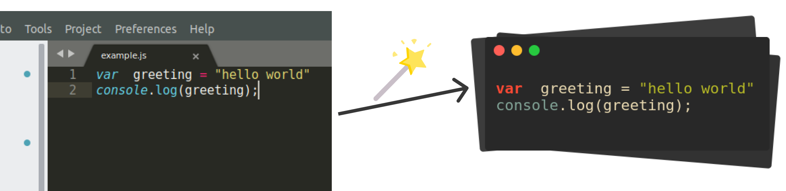

    

<h2 align="center">RamroCode  1.1.0 <h2>

  
✨ Beautiful screenshot of your code snippets
     
https://ramrocode.netlify.app

## Demo 🌟

😎 See how the code snippets look on a real blog post
[Snake game in 110 lines of code](https://medium.com/@bibhutipd/snake-game-in-110-lines-of-code-6033c936ce1f)

## Feature roadmap 📋
- [x] Better image quality for screenshots
- [ ] Dedicated code editor(Check `codemirror` branch for more updates)
- [ ] More cool designs for code snippets
- [ ] Support for line numbers
- [ ] Landing page to highlight its features

## Development 💻
Its a vuejs based project. If you have nodejs and vue-cli installed, you are already equipped with everythig you need.

- Clone this project: `git clone git@github.com:the-value-crew/ramroCode.git`
- Install dependencies: `npm install`
- Development : `npm run serve` 
- Build: `npm run build`

## Contribution 👋

If you would like to contribute to this awesome tool, please make a pull request. Or if you have some cool features in mind, please [create an issue](https://github.com/the-value-crew/ramroCode/issues/new). 

## License
[GPL 3.0](https://opensource.org/licenses/GPL-3.0)
Copyright (c) 2020-present
